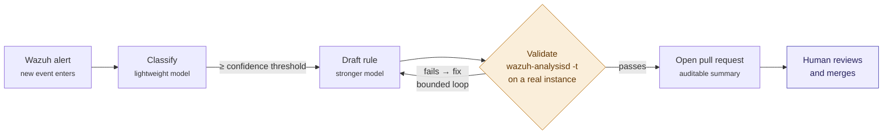

# Architecture

This document explains how the alert-tuning pipeline from Article 1 fits together, and — more importantly — where its two hard boundaries sit. The diagram renders on GitHub.

## The flow, step by step

1. **A new Wazuh alert enters.** The pipeline runs per-alert, and a duplicate check up front prevents multiple pull requests for the same rule ID.
2. **A lightweight model classifies** whether the alert is a false positive, returning a boolean, a confidence score, and its reasoning. Only alerts above a configurable confidence threshold proceed. Ambiguous cases are deliberately left out — it is better to miss a tuning opportunity than to suppress a borderline alert.
3. **A higher-capability model drafts** the narrowest possible suppression or detection rule. Narrow rules are harder to write and are the only kind worth writing; a broad rule hides future real alerts.
4. **The rule is validated against a real Wazuh instance** with `wazuh-analysisd -t`. This is the first hard boundary. If the daemon rejects the rule, its error message goes back to the model for a bounded number of fix attempts. If it still fails, the pipeline logs the error and opens no pull request.
5. **A passing rule opens a pull request** with a readable, auditable summary — the original alert, the classification reasoning, the rule change, and any caveats. The reasoning travels the whole way through, which is what makes the pipeline auditable.
6. **A human reviews and merges.** This is the second hard boundary. What arrives is a validated rule and a readable explanation, asking for a review decision — not original authorship.

## The two boundaries

The colours in the diagram are not decoration. They mark the two places where the pipeline's design refuses to compromise.

**Validation (amber) is a hard gate.** No generated rule — suppression or detection — reaches a review queue without loading cleanly on a running daemon. AI-generated rules face exactly the same bar as hand-written ones. *Validation before automation.*

**The merge (purple) is a human decision.** The pipeline drafts, validates, and documents. It does not deploy. What the pipeline cannot assess is whether suppressing a particular alert might hide a threat pattern that emerges later under different conditions — that judgment belongs with a person. *Judgment before delegation.*

## Backend independence

The model dispatch layer is abstracted behind a single interface. Switching from a public API to a self-hosted inference endpoint is a configuration change and a new base URL, not a rewrite. That is what makes the governance decision in [Article 2](../../articles/02-responsible-ai-operations.md) reversible — and it is recorded in [ADR-001](../../adr/ADR-001-inference-backend.md).
